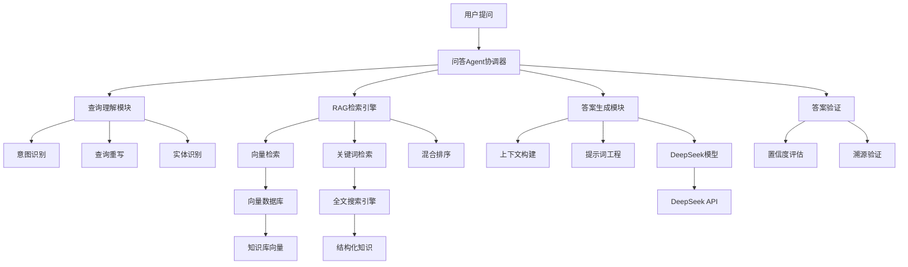
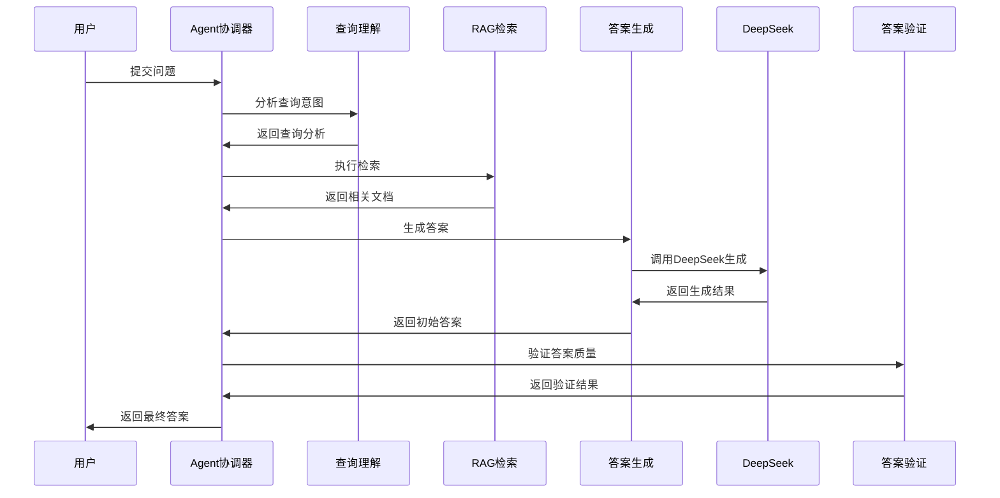
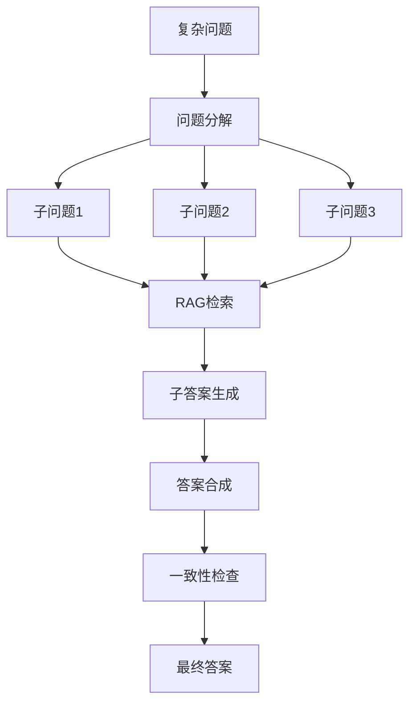

# 智能问答 Agent 技术方案
### 核心概念
- **项目名称**: SmartQA Agent - 智能问答助手
- **技术核心**: RAG (Retrieval-Augmented Generation) + Agent架构 + DeepSeek模型
- **核心目标**: 基于知识库的准确、可靠的智能问答系统
- **技术栈**: Spring AI + DeepSeek + 向量数据库 + 检索增强 + Agent决策

---

## 🏗️ 系统架构设计

### 整体架构概览


---

## 📋 核心组件设计

### 1. 问答Agent协调器
**职责**: 协调整个问答流程，制定回答策略
- **输入分析**: 解析用户问题类型和复杂度
- **流程决策**: 选择单轮检索或多轮复杂处理
- **质量把控**: 监控各环节质量，确保最终答案可靠性

### 2. RAG检索引擎
**职责**: 从知识库中检索相关信息片段
- **多路检索**: 向量检索 + 关键词检索混合
- **重排序**: 基于相关性、时效性、权威性综合排序
- **上下文选择**: 选择最相关的知识片段构建上下文

### 3. 查询理解模块
**职责**: 深度理解用户查询意图
- **意图分类**: 区分事实查询、解释性查询、操作指导等
- **查询扩展**: 基于同义词、相关概念扩展查询
- **实体链接**: 识别并链接到知识库中的实体

### 4. 答案生成模块（集成DeepSeek）
**职责**: 基于检索结果使用DeepSeek生成自然语言答案
- **上下文构建**: 组织检索到的信息片段
- **提示词优化**: 设计针对不同问题类型的提示词
- **答案合成**: 使用DeepSeek生成准确、简洁、易懂的答案

---

## 🗃️ 知识库架构

### 知识源管理
```
knowledge_sources/
├── 结构化知识/
│   ├── 产品文档/
│   ├── API文档/
│   └── 配置手册/
├── 非结构化知识/
│   ├── 技术博客/
│   ├── 问题解答/
│   └── 最佳实践/
└── 实时知识/
    ├── 产品更新/
    ├── 常见问题/
    └── 故障排除/
```

### 向量化策略
- **分块策略**: 按语义边界分块，重叠处理
- **嵌入模型**: 选择适合领域的中文嵌入模型
- **元数据**: 添加来源、更新时间、权威性等元数据

---

## 🔄 工作流程设计

### 标准问答流程


### 复杂问题处理流程


---

## 🎯 Agent决策逻辑

### 问题类型识别
| 问题类型 | 处理策略 | 检索方式 | 生成方式 |
| :--- | :--- | :--- | :--- |
| **事实查询** | 直接检索 | 精确匹配 | 简洁事实 |
| **解释性查询** | 概念检索 | 语义检索 | 详细解释 |
| **操作指导** | 步骤检索 | 过程检索 | 步骤化指导 |
| **比较分析** | 多概念检索 | 对比检索 | 对比分析 |
| **创意生成** | 灵感检索 | 关联检索 | 创意扩展 |

### 置信度管理
- **高置信度**: 直接返回答案
- **中置信度**: 添加不确定性说明
- **低置信度**: 建议用户重新表述或提供更多信息

---

## 🔧 技术组件设计

### 1. 向量检索服务
```java
// 伪代码 - 检索服务接口
public interface RetrievalService {
    List<KnowledgeChunk> retrieve(Query query, int topK);
    List<KnowledgeChunk> hybridRetrieve(Query query, int topK);
    double calculateRelevance(Query query, KnowledgeChunk chunk);
}
```

### 2. 问答生成服务（DeepSeek集成）
```java
// 伪代码 - 生成服务接口
public interface AnswerGenerationService {
    Answer generateAnswer(Query query, List<KnowledgeChunk> context);
    Answer generateWithVerification(Query query, List<KnowledgeChunk> context);
    String buildPrompt(Query query, List<KnowledgeChunk> context, AnswerStyle style);
}

// DeepSeek集成服务
@Service
public class DeepSeekService {
    private final OpenAiChatClient chatClient;

    public DeepSeekService(OpenAiChatClient chatClient) {
        this.chatClient = chatClient;
    }

    public String generateAnswer(String prompt) {
        return chatClient.call(prompt);
    }
}
```

### 3. Agent协调服务
```java
// 伪代码 - Agent协调接口
public interface QAAgent {
    AgentResponse processQuestion(UserQuestion question);
    QuestionAnalysis analyzeQuestion(UserQuestion question);
    AnswerPlan createAnswerPlan(QuestionAnalysis analysis);
    Answer executeAnswerPlan(AnswerPlan plan);
}
```

---

## ⚙️ 系统配置方案

### DeepSeek配置
```yaml
spring:
  ai:
    openai:
      api-key: ${DEEPSEEK_API_KEY}
      base-url: https://api.deepseek.com/v1
      chat:
        options:
          model: deepseek-chat
          temperature: 0.1
          max-tokens: 2000
```

### RAG配置参数
```yaml
rag:
  retrieval:
    vector-weight: 0.7
    keyword-weight: 0.3
    top-k-initial: 20
    top-k-final: 5
    similarity-threshold: 0.7
    
  generation:
    max-context-length: 4000
    include-sources: true
    confidence-threshold: 0.8
    
  knowledge-base:
    chunk-size: 512
    chunk-overlap: 50
    update-interval: 3600
```

### Agent决策配置
```yaml
agent:
  question-classification:
    enabled: true
    model: "question-classifier"
    
  answer-strategy:
    simple-query: "direct-retrieval"
    complex-query: "multi-step"
    ambiguous-query: "clarification"
    
  quality-control:
    enable-verification: true
    min-confidence: 0.6
    fallback-strategy: "suggest-alternative"
```

---

## 📊 性能与扩展设计

### 性能优化策略
- **缓存层**: 高频问题和答案缓存
- **异步处理**: 复杂问题异步处理
- **批量检索**: 批量处理相似查询
- **索引优化**: 多级索引结构

### 扩展性设计
- **模块化架构**: 各组件可独立扩展
- **插件机制**: 支持新的检索器和生成器
- **配置驱动**: 行为通过配置调整
- **监控指标**: 全面的性能监控

---

## 🛡️ 质量保障体系

### 答案质量评估
- **相关性**: 答案与问题的匹配程度
- **准确性**: 事实的正确性
- **完整性**: 信息覆盖全面性
- **可读性**: 语言表达清晰度

### 溯源与验证
- **来源标注**: 每个事实标注知识来源
- **置信度评分**: 基于多个维度的置信度计算
- **用户反馈**: 基于用户反馈持续优化

---

## 🚀 部署架构

### 开发环境
```
单体架构:
├── Spring Boot应用
├── 向量数据库 (Chroma)
├── 关系数据库 (MySQL)
├── 缓存 (Redis)
└── 搜索引擎 (Elasticsearch)
```

### 生产环境
```
微服务架构:
├── 问答Agent服务
├── 检索服务
├── 生成服务（DeepSeek集成）
├── 知识库管理服务
└── 用户会话服务
```

---

## 📈 演进路线

### Phase 1: 基础RAG (2-3周)
- [ ] 基础检索和生成流程
- [ ] DeepSeek模型集成
- [ ] 简单问答场景支持
- [ ] 基础知识库构建

### Phase 2: Agent增强 (2-3周)
- [ ] 问题分类和策略选择
- [ ] 多步推理能力
- [ ] 答案验证机制

### Phase 3: 高级功能 (2-3周)
- [ ] 多轮对话支持
- [ ] 个性化回答
- [ ] 实时知识更新

### Phase 4: 优化部署 (1-2周)
- [ ] 性能优化
- [ ] 监控告警
- [ ] 生产部署

---

## 💡 技术亮点

### 核心创新点
1. **智能Agent决策**: 基于问题复杂度的自适应处理策略
2. **混合检索策略**: 向量+关键词+规则的混合检索
3. **DeepSeek集成**: 利用高性能中文大模型生成答案
4. **质量保障体系**: 多层次的答案质量验证
5. **可解释性**: 完整的答案溯源和置信度说明

### 业务价值
- 提供准确可靠的智能问答服务
- 支持复杂问题的深度解答
- 具备持续学习和改进能力
- 可应用于多个领域的知识问答场景

这个技术方案提供了一个完整的智能问答Agent设计框架，集成了DeepSeek大模型，既包含了核心技术组件，又考虑了实际部署和扩展需求，可以作为项目开发的详细指导方案。